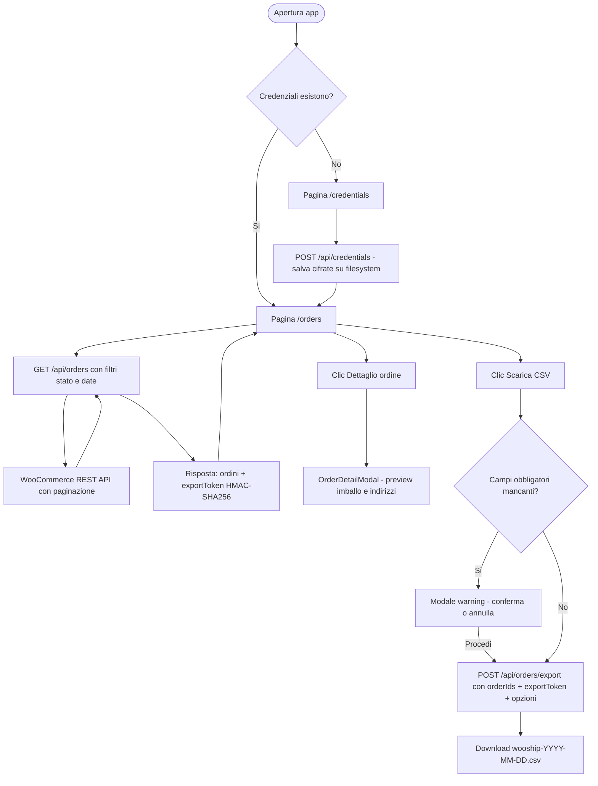

# WooShip

Applicazione Next.js per estrarre ordini da WooCommerce e generare CSV semicolon-delimited pronti per software di spedizione (tracciato a 46 colonne).

## Funzionalità

- Recupero ordini da WooCommerce tramite REST API (con paginazione automatica)
- Filtro per stato ordine e intervallo di date
- Selezione e deselezione massiva degli ordini
- Preview della composizione dell'imballo per ogni ordine (modale dedicata)
- Algoritmo di packaging automatico: calcola il tipo e numero di colli in base alle bottiglie (0,75 L e Magnum)
- Export CSV a 46 colonne con tracciato fisso (separatore `;`)
- Gestione contrassegno (COD) con intestatario e importo sul primo collo
- Warning sui campi obbligatori mancanti nell'indirizzo di spedizione
- Protezione accesso tramite HTTP Basic Auth (middleware Next.js)
- Cifratura AES-256-GCM delle credenziali WooCommerce salvate su filesystem

## Logica di Packaging

L'algoritmo (`lib/packaging.ts`) distingue bottiglie 0,75 L da Magnum (rilevate per nome prodotto) e produce:

| Bottiglie totali | Tipo di spedizione |
|---|---|
| 0 | 1 × COLLO-STANDARD (generico) |
| 1–36 | Colli individuali (COLLO-MAGNUM, COLLO-075-S/M/L) |
| 37–48 | 1 × PALLET-BASSO (45 cm) |
| > 48 | 1 × PALLET-ALTO (75 cm) |

Per ordini ≤ 36 bottiglie 0,75 L, i colli vengono raggruppati da 6 (COLLO-075-L), poi da 2–5 (ancora COLLO-075-L), e infine da 1–3 (COLLO-075-M). Ogni Magnum diventa sempre un collo separato (COLLO-MAGNUM).

Il COD è associato solo al primo collo generato.

## Tech Stack

- **Next.js 15** (App Router)
- **React 19** + **TypeScript 5**
- **Tailwind CSS 3**
- **Vitest 2** (test unitari)
- **Husky** (pre-commit hook)
- Cifratura server-side con **AES-256-GCM** (`node:crypto`)

## Flusso Applicativo



## Quick Start

### 1) Prerequisiti

- Node.js 20+
- npm 10+

### 2) Installa dipendenze

```bash
npm install
```

### 3) Crea il file `.env.local`

Chiave di cifratura obbligatoria (deve essere esattamente 64 caratteri hex = 32 byte):

```env
ENCRYPTION_KEY=INSERISCI_QUI_64_CARATTERI_HEX
```

Genera una chiave valida con:

```bash
node -e "console.log(require('crypto').randomBytes(32).toString('hex'))"
```

Credenziali WooCommerce via environment (alternativa al form UI):

```env
WOOCOMMERCE_STORE_URL=https://tuo-shop.it
WOOCOMMERCE_CONSUMER_KEY=ck_xxx
WOOCOMMERCE_CONSUMER_SECRET=cs_xxx
```

Profilo mittente Truckpooling (consigliato in `.env.local`, non versionato):

```env
TP_SENDER_LAST_NAME="Ragione sociale o cognome mittente"
TP_SENDER_FIRST_NAME="Nome mittente"
TP_SENDER_STREET="Via mittente"
TP_SENDER_STREET_NUMBER="Numero civico"
TP_SENDER_CITY="Citta"
TP_SENDER_PROVINCE="Provincia ISO2"
TP_SENDER_ZIP="CAP"
TP_SENDER_COUNTRY="IT"
TP_SENDER_PHONE="+39 ..."
TP_SENDER_EMAIL="mail@dominio.it"
# opzionale
TP_SENDER_CO="presso/campanello"
```

In export CSV il campo `package_type` viene normalizzato in formato Truckpooling:

- `COLLO-*` -> `pacco`
- `PALLET-*` -> `pallet`

Dettagli export aggiuntivi:

- `pickup_date` viene convertito automaticamente da `YYYY-MM-DD` a `DD/MM/YYYY`
- `to_street` e `to_street_number` vengono separati automaticamente quando l'indirizzo contiene il civico in coda (es. `Via Roma 10`)
- `to_phone` usa prima `shipping.phone`, con fallback a `billing.phone`

Protezione accesso (facoltativa in locale, bloccante in produzione Vercel se non impostata):

```env
APP_BASIC_AUTH_USER=admin
APP_BASIC_AUTH_PASSWORD=password-lunga-e-casuale
```

### 4) Avvia in sviluppo

```bash
npm run dev
```

Apri http://localhost:3000

> **Nota sul Basic Auth**: in locale, se `APP_BASIC_AUTH_USER` / `APP_BASIC_AUTH_PASSWORD` non sono impostate, il middleware lascia passare tutto. In produzione Vercel (variabile `VERCEL_ENV=production`) risponde 500 se le variabili mancano.

## Modalità Credenziali

| Modalità | Come funziona |
|---|---|
| Environment variables | Legge `WOOCOMMERCE_*` da ambiente (priorità) |
| Filesystem cifrato | Salva credenziali AES-256-GCM in `.data/credentials.enc` |

> In ambienti senza filesystem persistente (es. Vercel) usa preferibilmente le variabili `WOOCOMMERCE_*`.

## Endpoint API

| Endpoint | Metodo | Scopo |
|---|---|---|
| `/api/health` | GET | Check su `ENCRYPTION_KEY`, storage mode e storeUrl |
| `/api/storage-mode` | GET | Ritorna `filesystem` o `environment` |
| `/api/credentials` | GET / POST / DELETE | Stato, salvataggio e rimozione credenziali |
| `/api/orders` | GET | Recupero ordini WooCommerce (con filtri e paginazione) |
| `/api/orders/export` | POST | Generazione CSV delle righe selezionate |

## Comandi Sviluppo

```bash
npm run dev       # avvia Next.js in sviluppo
npm run build     # build di produzione
npm run start     # avvia server di produzione
npm run lint      # ESLint
npm run test      # Vitest (92 test unitari)
```

## CI

La repository include 4 workflow GitHub Actions:

- `ci.yml` (`.github/workflows/ci.yml`): type-check, lint e test su push/PR verso `main`
- `codeql.yml` (`.github/workflows/codeql.yml`): scansione statica sicurezza/qualita con CodeQL su push/PR verso `main` + scansione schedulata settimanale
- `sonarcloud.yml` (`.github/workflows/sonarcloud.yml`): analisi statica SonarCloud su push/PR verso `main`
- `lighthouse.yml` (`.github/workflows/lighthouse.yml`): audit Lighthouse CI su ogni PR verso `main`

### Setup SonarCloud (una tantum)

1. Crea un progetto su SonarCloud e collega questa repository GitHub.
2. In GitHub -> Settings -> Secrets and variables -> Actions configura:
    - **Secret**: `SONAR_TOKEN`
    - **Variables**: `SONAR_ORGANIZATION`, `SONAR_PROJECT_KEY`
3. Apri una PR (o fai push su `main`) per avviare la pipeline SonarCloud.

Se mancano secret/variables, il job SonarCloud fallisce con errore esplicito.

### Lighthouse CI su PR

Configurazione in `.lighthouserc.json`.

Il workflow esegue automaticamente:

1. `npm ci`
2. `npm run build && npm run start -- -p 3000`
3. Audit Lighthouse sulle pagine:
    - `http://localhost:3000/`
    - `http://localhost:3000/credentials`

Soglie attive:

- Performance >= 0.80 (errore)
- Accessibility >= 0.90 (errore)
- Best Practices >= 0.90 (errore)
- SEO >= 0.85 (warning)

Esecuzione locale opzionale:

```bash
npx @lhci/cli@0.15.x autorun --config=.lighthouserc.json
```

### Dove leggere i risultati

- **CodeQL**: tab **Security -> Code scanning** su GitHub
- **SonarCloud**: dashboard progetto SonarCloud e decorazione PR
- **Lighthouse CI**: artifacts del workflow e report temporaneo pubblico (link nel job)

## Test

92 test unitari coprono:

- **`lib/csv-generator.test.ts`** — generazione CSV: struttura header, valori COD, più colli per ordine, escaping semicolon
- **`lib/packaging.test.ts`** — algoritmo di packaging: tutti i tipi di collo, soglie pallet, ordini misti Magnum/0.75 L, edge case (0 bottiglie, 1 bottiglia, soglie esatte)

## Sicurezza

- Credenziali WooCommerce cifrate con AES-256-GCM; la chiave è esclusivamente in `ENCRYPTION_KEY`
- Se `ENCRYPTION_KEY` è assente o non valida, le API `/api/orders` e `/api/orders/export` falliscono in hard-fail
- Token export confrontato con `crypto.timingSafeEqual` (anti-timing attack)
- Le API mutative verificano l'header `Origin` contro l'host corrente (anti-CSRF)
- Tutta l'applicazione è protetta da HTTP Basic Auth tramite middleware Next.js

## Deploy (Vercel)

1. Imposta `ENCRYPTION_KEY` (64 char hex)
2. Imposta `APP_BASIC_AUTH_USER` e `APP_BASIC_AUTH_PASSWORD`
3. Se il filesystem non è persistente, imposta anche `WOOCOMMERCE_STORE_URL`, `WOOCOMMERCE_CONSUMER_KEY`, `WOOCOMMERCE_CONSUMER_SECRET`
4. Verifica `/api/health` dopo il deploy

## Troubleshooting

### `ENCRYPTION_KEY` non valida

- Sintomo: `/api/health` ritorna `keyValid: false`
- Fix: rigenera la chiave e verifica che sia esattamente 64 caratteri hex

### Credenziali non salvate in deploy

- Causa: filesystem non persistente (es. Vercel)
- Fix: usa le variabili `WOOCOMMERCE_*` invece del form UI

### Export fallisce con 403

- Causa: token scaduto o mismatch sugli ordini selezionati
- Fix: riesegui il fetch degli ordini e ripeti l'export

### Authentication required (401)

- Causa: credenziali Basic Auth mancanti o errate
- Fix: verifica `APP_BASIC_AUTH_USER` e `APP_BASIC_AUTH_PASSWORD`
