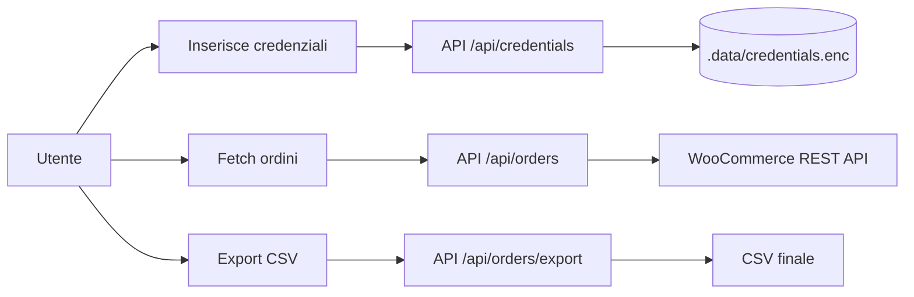

# WooShip

Applicazione Next.js per estrarre ordini da WooCommerce e generare CSV pronti per software di spedizione.

## Perche e utile

WooShip riduce il flusso manuale classico:

- recupero ordini da WooCommerce
- filtro per stato e intervallo date
- selezione massiva
- export CSV con tracciato fisso a 46 colonne
- controllo warning sui campi mancanti prima del download

## Tech Stack

- Next.js 15 (App Router)
- React 19 + TypeScript
- Tailwind CSS
- Vitest
- Cifratura server-side con AES-256-GCM

## Flusso Applicativo



## Quick Start

### 1) Prerequisiti

- Node.js 20+
- npm 10+

### 2) Installa dipendenze

```bash
npm install
```

### 3) Crea il file `.env.local`

Inserisci almeno la chiave di cifratura:

```env
ENCRYPTION_KEY=INSERISCI_QUI_64_CARATTERI_HEX
```

Genera una chiave valida con:

```bash
node -e "console.log(require('crypto').randomBytes(32).toString('hex'))"
```

Variabili opzionali (se vuoi evitare il form UI):

```env
WOOCOMMERCE_STORE_URL=https://tuo-shop.it
WOOCOMMERCE_CONSUMER_KEY=ck_xxx
WOOCOMMERCE_CONSUMER_SECRET=cs_xxx
```

Protezione accesso (consigliata anche in locale, obbligatoria in produzione Vercel):

```env
APP_BASIC_AUTH_USER=admin
APP_BASIC_AUTH_PASSWORD=password-lunga-e-casuale
```

### 4) Avvia in sviluppo

```bash
npm run dev
```

Apri http://localhost:3000

## Modalita Credenziali

| Modalita | Come funziona | Stato |
| --- | --- | --- |
| Environment variables | Legge `WOOCOMMERCE_*` da ambiente | Disponibile |
| Filesystem encrypted | Salva credenziali cifrate in `.data/credentials.enc` | Disponibile |
| Session cookie fallback | Fallback per ambienti read-only | Non ancora implementato |

Nota importante: in ambienti senza filesystem persistente usa preferibilmente le variabili `WOOCOMMERCE_*`.

## Endpoint Utili

| Endpoint | Metodo | Scopo |
| --- | --- | --- |
| `/api/health` | GET | Check rapido su `ENCRYPTION_KEY`, storage mode e storeUrl |
| `/api/storage-mode` | GET | Ritorna `filesystem` o `session_cookie` |
| `/api/credentials` | GET/POST/DELETE | Stato, salvataggio e rimozione credenziali |
| `/api/orders` | GET | Recupero ordini WooCommerce + export token |
| `/api/orders/export` | POST | Generazione CSV delle righe selezionate |

## Comandi Sviluppo

```bash
npm run dev
npm run build
npm run start
npm run test
npm run lint
```

## Sicurezza

- credenziali cifrate con AES-256-GCM
- chiave letta solo da `ENCRYPTION_KEY` (se assente/non valida, le API ordini/export falliscono in hard-fail)
- confronto token export con `timingSafeEqual`
- credenziali WooCommerce gestite solo lato server
- API mutative protette con controllo same-origin (anti-CSRF)
- applicazione protetta con HTTP Basic Auth tramite middleware

## Deploy (Vercel e simili)

Configurazione minima consigliata:

1. imposta `ENCRYPTION_KEY`
2. imposta `APP_BASIC_AUTH_USER` e `APP_BASIC_AUTH_PASSWORD`
3. se il filesystem non e persistente, imposta anche `WOOCOMMERCE_*`
4. verifica `/api/health` dopo il deploy

## Troubleshooting

### Errore su ENCRYPTION_KEY

- sintomo: `/api/health` ritorna `keyValid: false`
- fix: rigenera la chiave e verifica che sia lunga esattamente 64 caratteri hex

### Credenziali non salvate in deploy

- causa probabile: ambiente read-only o filesystem non persistente
- fix: usa variabili `WOOCOMMERCE_STORE_URL`, `WOOCOMMERCE_CONSUMER_KEY`, `WOOCOMMERCE_CONSUMER_SECRET`

### Export non valido (403)

- causa: token scaduto o mismatch su ordini selezionati
- fix: riesegui fetch ordini e ripeti export

### Authentication required (401)

- causa: credenziali Basic Auth mancanti o errate
- fix: verifica `APP_BASIC_AUTH_USER` e `APP_BASIC_AUTH_PASSWORD` su Vercel e nel browser
